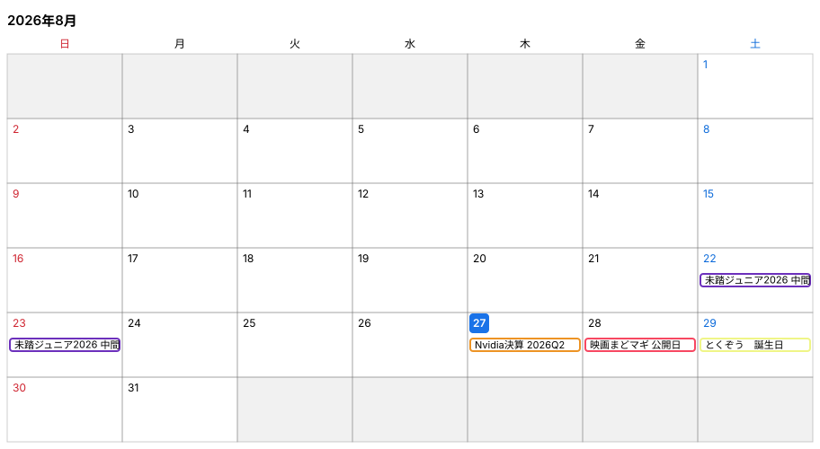
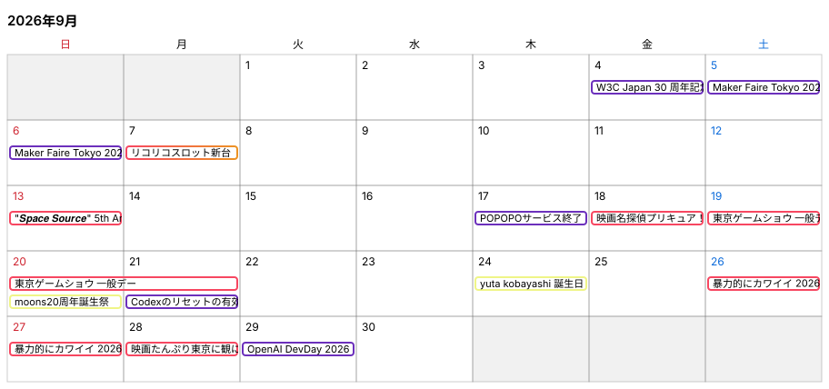

# カレンダー

<!-- zunocal:calendar:start -->



<!-- zunocal:calendar:end -->

[zunoser Project #3](https://github.com/orgs/zunoser/projects/3)

## 購読

[Google カレンダーに追加](https://calendar.google.com/calendar/r?cid=webcal%3A%2F%2Fraw.githubusercontent.com%2Fzunoser%2Fcalendar%2Fmain%2Fics%2Fcalendar.ics)

<details>
<summary>Apple カレンダー / Outlook:</summary>

```
webcal://raw.githubusercontent.com/zunoser/calendar/main/ics/calendar.ics
```

</details>

<details>
<summary>その他:</summary>

```url
https://raw.githubusercontent.com/zunoser/calendar/main/ics/calendar.ics
```

</details>

## コマンド

```sh
pnpm zunocal view                # カレンダーをテーブル表示
pnpm zunocal check [--dry-run]   # 日付の整合性を検査し Date status を Error/Next に更新
pnpm zunocal close [--dry-run]   # 終了日が過去の open な Issue を close
pnpm zunocal remind 3d|1d [--dry-run] # 開始前に担当者全員を Issue コメントでメンション
pnpm zunocal ics [--out <path>]  # iCalendar を書き出す (既定: ics/calendar.ics)
pnpm zunocal svg [--dir <path>] [--readme <path>] # 今月と来月の画像を書き出し、指定時はREADMEも更新
```

## 開発

Nix を利用する場合は、`direnv allow` または `nix develop` で Node.js と Corepack 管理の pnpm が入った開発環境を利用できる。

```sh
pnpm install
pnpm test              # ユニットテスト (純粋ロジックのみ)
pnpm test:integration  # 実 API への Read 専用テスト (要 TOKEN)
pnpm typecheck
pnpm lint
pnpm fmt
```

### リポジトリ基盤

`infra/github` では、バージョン固定した OpenTofu モジュール
`zunoser/tfmodule-gh-repo-kit` を使ってこのリポジトリを管理している。
state は共有 R2 バックエンドの
`github/repositories/calendar/terraform.tfstate` に保存し、リポジトリラベルは
`infra/github/labels.tf` でモジュールとあわせて宣言している。

認証情報なしで静的検証できる:

```sh
tofu -chdir=infra/github init -backend=false
tofu -chdir=infra/github validate
```

実際の plan には、R2 バックエンドの認証情報と GitHub トークンも必要になる。

### パッケージ構成

| パッケージ        | 役割                                                                                          |
| ----------------- | --------------------------------------------------------------------------------------------- |
| `packages/cli`    | コマンド定義と表示 ([citty](https://github.com/unjs/citty))                                   |
| `packages/core`   | 設定 (`parseConfig`) とサービス (`getGitHubCalendar`)、純粋なイベント操作                     |
| `packages/github` | GitHub GraphQL の repository 層 ([gql.tada](https://gql-tada.0no.co/) + graphql-request)      |
| `packages/ics`    | iCalendar 生成 ([ical-generator](https://github.com/sebbo2002/ical-generator) の薄いアダプタ) |
| `packages/svg`    | 月グリッドのカレンダー画像 (SVG) 生成                                                         |
| `packages/utils`  | 汎用ユーティリティ                                                                            |

GitHub の GraphQL スキーマは `packages/github/schema.docs.graphql` にベンダリングしている
([公式の公開スキーマ](https://docs.github.com/public/fpt/schema.docs.graphql) をダウンロードしたもの)。
スキーマを更新したら型定義を再生成する:

```sh
curl -sL -o packages/github/schema.docs.graphql https://docs.github.com/public/fpt/schema.docs.graphql
pnpm --filter @zunoser/calendar-github exec gql-tada generate-output
```
